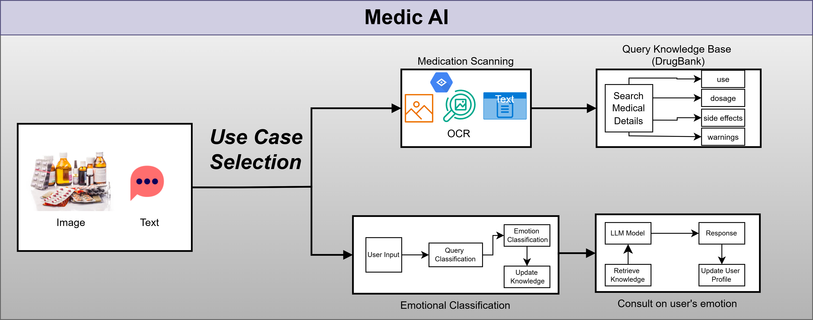
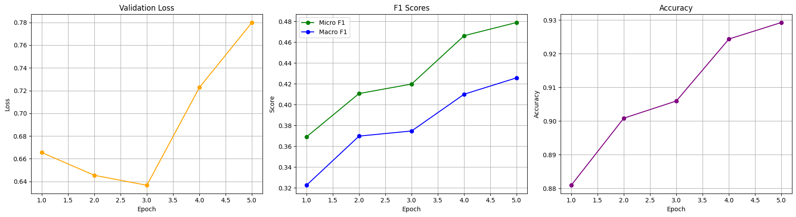

# Medic AI: AI for your medical needs

## Project Overview

Medic AI is a mobile application that leverages artificial intelligence to make healthcare more accessible. It includes two core features:

1. **AI Medicine Scanning**: Takes photos of medicine packaging to extract key details like drug name and dosage, providing clear summaries to help users use medications correctly.

2. **AI Therapist Chatbot**: Engages with users to support their mental health, offering coping tips and suggesting professional help when needed.

## Problem Statement

Healthcare currently struggles to meet everyone's needs. Two significant problems addressed by Medic AI:

- **Limited Access to Medication Information**: Patients often struggle to interpret complex medication labels or lack immediate access to doctors for clarifications, increasing risks of incorrect usage and preventable harm.

- **Mental Health Support Barriers**: Many people need help with mental health but face obstacles like cost, limited options, or social stigma against seeking help.

## System Architecture

## Use Cases

### Use Case 1: AI Medicine Scanning

Helps users understand dense, technical medication labels by taking a simple picture of the medicine.

**Workflow:**
1. **Image Capture & Upload**: User takes a photo of medicine packaging, focusing on the label.
2. **Text Extraction**: Uses OCR to convert image to text and clean up irrelevant information.
3. **Entity Recognition & Database Query**: Extracts drug name, dosage, side effects, and other important information from our database.
4. **Information Summarization and Output**: Generates concise, user-friendly information related to the drug.

**Expected Results**: Users understand their medications better, reducing medication errors and helping people be more informed about their prescriptions.

### Use Case 2: AI Therapist Chatbot

Offers immediate, private mental health support through conversation, with memory of past interactions for personalized assistance.

**Workflow:**
1. **User Interaction**: User opens the chatbot and begins conversation.
2. **Conversational Support**: The chatbot analyzes the user's words and replies with supportive feedback and useful tips.
3. **Personalized Assistance**: Assesses user's emotions and suggests mental exercises based on their input.

**Expected Results**: Faster access to mental health support, reducing feelings of isolation and connecting more people with mental health resources.

## Methodology

### Dataset

**DrugBank Dataset**: Contains structured pharmaceutical information including drug identifiers, names, indications, dosages, contraindications, interactions, and side effects.

**GoEmotions Dataset**: Used for multi-label emotion classification, comprising Reddit comments annotated with 28 emotion categories.

### Models

**Medication Scanning**:
- **OCR**: Google Cloud Vision API for text extraction
- **Entity Extraction**: SpaCy enhanced with fuzzy matching
- **Knowledge Base Query**: FAISS for retrieval of structured drug information
- **Semantic Retrieval**: all-MiniLM-L6-v2 model for generating dense embeddings
- **Response Generation**: Mistral-7B-Instruct-v0.2 for summarizing retrieved details

**Mental Support Chatbot**:
- **Emotion Classification**: BERT-base-uncased for detecting 28 emotion categories
- **Conversational Response**: Mistral-7B-Instruct-v0.2 fine-tuned for empathetic replies

### Training

**Medication Scanning**: Minimal training required as it uses pre-trained models, with fine-tuning applied as needed.

**Mental Support Chatbot**: 
- Trained with custom weights to handle class imbalance
- Utilizes binary cross-entropy loss with logits
- Batch size of 16, learning rate of 2e-5, weight decay of 0.03
- Maximum of 5 epochs with early stopping

### Evaluation Metrics

**Medication Scanning**:

| **Metric** | **Description** | **Data Source** | **Ground Truth** | **Expected Result** | **Actual Result** |
|------------|----------------|----------------|-----------------|-------------------|-----------------|
| **OCR Accuracy** | Percentage of correctly extracted text (e.g., "Calpol 500 mg") | OCR output | "Calpol 500 mg" | > 95% | TBD |
| **Entity Extraction F1** | Balance of precision and recall for drug name detection (e.g., "calpol") | Extracted entities | ["calpol"] | F1 = 1.0 | TBD |
| **Retrieval Precision** | Relevance of retrieved drug facts (e.g., "paracetamol" for "calpol") | Retrieved DrugBank entry | Paracetamol facts | 1.0 | TBD |
| **Task Completion Rate** | % of user queries yielding correct drug facts | Final chat output | "Calpol 500 mg" → Paracetamol facts | > 85% | TBD |

**Mental Support Chatbot**:

- **Micro F1**: Assesses overall precision and recall across all labels
- **Macro F1**: Averages F1 scores per label to highlight performance on less frequent emotions
- **Accuracy**: Reflects the proportion of correctly predicted labels
- **Validation Loss**: Key criterion for model selection

## Research Questions

1. How effectively can Medic AI summarize and extract key medication information from medicine images using multimodal NLP, compared to standard medical databases?

2. What NLP and image recognition techniques yield the highest accuracy and speed for extracting structured medical details from medicine labels compared with traditional OCR methods?

3. How well can a fine-tuned conversational AI model, guided by multi-label emotion detection, maintain contextual relevance and empathy in a no-redirection mental health chatbot?

4. How consistently does the AI Therapist Chatbot achieve high user satisfaction when responding to predefined anger and depression scripts in a single session?

## Team

- **Team Name**: Semantic Bard
- **Members**:
  - Htet Wai Yan Htut - Department of Data Sciences and Artificial Intelligence, Asian Institute of Technology
  - Zwe Htet - Department of Data Sciences and Artificial Intelligence, Asian Institute of Technology
  - Mya Mjechal - Department of Data Sciences and Artificial Intelligence, Asian Institute of Technology
- **Medical Advisor**: Dr. Khin Lay Phyu (M.B.,B.S)

## Project Status

- ✅ Revised project scope to align with project duration
- ✅ Confirmed datasets and models for implementation
- 🔄 Continuing implementation of identified datasets and models
- 🔄 Revising project proposal based on feedback
- 🔄 Beginning system development

## License

This project is licensed under the MIT License. See the LICENSE file for more details.

## Acknowledgments

This project is being developed for fulfillment of the project proposal for AT82.05, Artificial Intelligence: Natural Language Understanding, under Asst. Prof. Chaklam Silpasuwanchai at Asian Institute of Technology.
