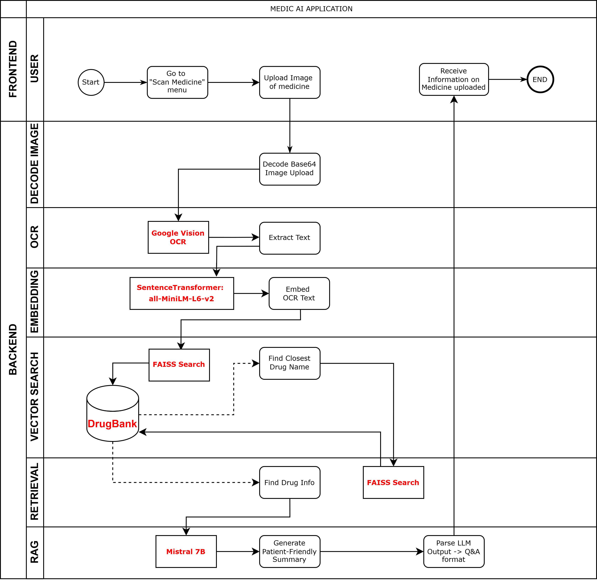
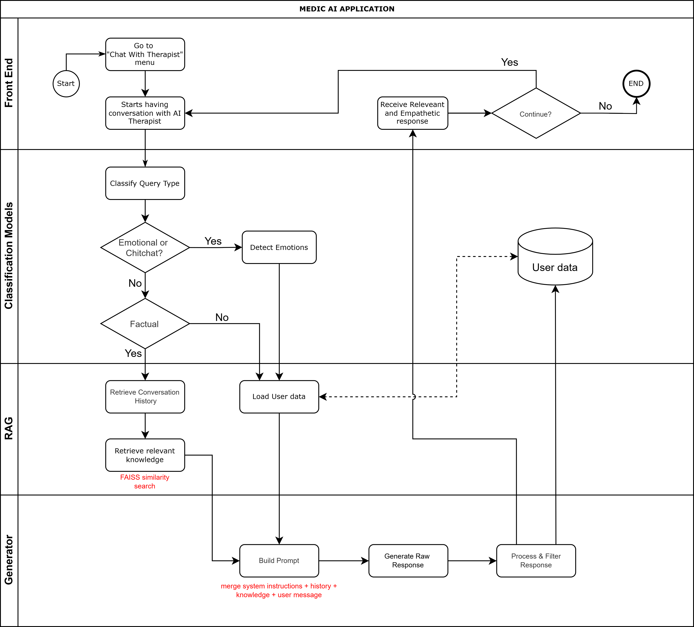
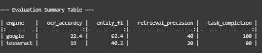

# Medic AI: AI for Your Medical Needs

## Project Overview

Medic AI is a mobile application leveraging artificial intelligence to enhance healthcare accessibility. It features two core components:

1. **AI Medicine Scanning**: Captures photos of medicine packaging to extract critical details such as drug name and dosage, delivering clear summaries to ensure correct medication use.
2. **AI Therapist Chatbot**: Engages users in supportive conversations to promote mental health, offering coping strategies and recommending professional help when necessary.

## Problem Statement

Medic AI addresses two significant healthcare challenges:

- **Limited Access to Medication Information**: Patients often struggle to decipher complex medication labels or lack immediate access to medical professionals, increasing the risk of incorrect usage and harm.
- **Mental Health Support Barriers**: Cost, limited availability, and social stigma prevent many individuals from accessing mental health support.

## System Architecture

## Use Cases

### Use Case 1: AI Medicine Scanning

This feature assists users in understanding complex medication labels by photographing medicine packaging.

**Workflow:**
1. **Image Capture & Upload**: Users photograph the medicine label, which is sent to Medic AI's backend.
2. **Text Extraction**: OCR technology converts the image to text, filtering out irrelevant content.
3. **Entity Recognition & Database Query**: Extracts drug name, dosage, side effects, and other details from a database.
4. **Information Summarization and Output**: Provides a concise, user-friendly summary of the drug information.

**Results**: Users gain a better understanding of their medications, reducing errors and improving adherence to prescriptions.

### Use Case 2: Chat with Therapist

The chatbot provides immediate, private mental health support, retaining context from previous interactions for personalized care.

**Workflow:**
1. **User Interaction**: Users initiate a conversation with the chatbot, which prompts them to share their feelings.
2. **Conversational Support**: The chatbot analyzes user input and responds with empathetic feedback and practical advice.
3. **Personalized Assistance**: Assesses emotions and suggests tailored mental health exercises.

**Results**: Users access timely mental health support, reducing isolation and increasing engagement with mental health resources.

## Methodology

### Dataset

- **DrugBank Dataset**: Provides structured pharmaceutical data, including drug names, indications, dosages, contraindications, interactions, and side effects.
- **GoEmotions Dataset**: Contains Reddit comments annotated with 28 emotion categories for multi-label emotion classification.

### Models

**Medication Scanning**:
- **OCR**: Google Cloud Vision API for accurate text extraction.
- **Entity Extraction**: SpaCy with fuzzy matching for robust drug name identification.
- **Knowledge Base Query**: FAISS for retrieving structured drug information.
- **Semantic Retrieval**: all-MiniLM-L6-v2 for generating dense embeddings.
- **Response Generation**: Mistral-7B-Instruct-v0.2 for concise, factual summaries.

**Mental Support Chatbot**:
- **Emotion Classification**: BERT-base-uncased for detecting 28 emotion categories.
- **Conversational Response**: Mistral-7B-Instruct-v0.2, fine-tuned for empathetic and contextually relevant replies.

### Training

- **Medication Scanning**: Utilizes pre-trained models with minimal fine-tuning, focusing on customized prompt generation for user-friendly outputs.
- **Mental Support Chatbot**: 
  - Trained with custom weights to address class imbalance.
  - Uses binary cross-entropy loss with logits.
  - Configured with a batch size of 16, learning rate of 2e-5, weight decay of 0.03, and a maximum of 5 epochs with early stopping.

### Evaluation Metrics

**Medication Scanning**:

| **Metric** | **Description** | **Data Source** | **Ground Truth** | **Expected Result** | **Actual Result** |
|------------|----------------|----------------|-----------------|-------------------|-----------------|
| **OCR Accuracy** | Percentage of correctly extracted text (e.g., "Calpol 500 mg") | OCR output | "Calpol 500 mg" | > 95% | 22.4% (Google Vision), 19% (Tesseract) |
| **Entity Extraction F1** | Balance of precision and recall for drug name detection (e.g., "calpol") | Extracted entities | ["calpol"] | F1 = 1.0 | 62.4% (Google Vision), 40.2% (Tesseract) |
| **Retrieval Precision** | Relevance of retrieved drug facts (e.g., "paracetamol" for "calpol") | Retrieved DrugBank entry | Paracetamol facts | 1.0 | 40% (Google Vision), 20% (Tesseract) |
| **Task Completion Rate** | % of user queries yielding correct drug facts | Final chat output | "Calpol 500 mg" → Paracetamol facts | > 85% | 100% (Google Vision), 80% (Tesseract) |

**Mental Support Chatbot**:

- **Micro F1**: Measures overall precision and recall across all labels.
- **Macro F1**: Averages F1 scores per label, emphasizing performance on less frequent emotions.
- **Accuracy**: Proportion of correctly predicted labels.
- **Validation Loss**: Guides model selection.
- **Conversational Metrics**: BLEU and ROUGE for response coherence, supplemented by human evaluations for empathy and relevance.

| Model                         | Release   | Tokenizer    | MMLU   | Medical Strengths              | Instruction | Speed       |
|-------------------------------|-----------|--------------|--------|--------------------------------|-------------|-------------|
| Mistral-7B-Instruct-v0.2      | Oct 2023  | BPE (32k)    | 60.1%  | Strong reasoning, emotional nuance | Excellent   | High        |
| TinyLlama-1.1B-Chat-v1.0      | Jan 2024  | BPE (32k)    | 25.3%  | Limited medical knowledge      | Moderate    | Very fast   |
| Qwen-7B-Chat                  | Sep 2023  | TickToken    | 58.2%  | Good multilingual support      | Good        | Comparable  |
| DeepSeek-7B-Chat              | Jan 2024  | BPE (100k)   | 59.8%  | Strong code generation         | Very good   | Moderate    |
| MPT-7B-Chat                   | May 2023  | NeoX (50k)   | 35.0%  | Limited emotional nuance       | Good        | Lower       |

**Evaluation Results**:
- **Medication Scanning**: Google Vision outperformed Tesseract across all metrics, with 22.4% OCR accuracy, 62.4% Entity Extraction F1, 40% Retrieval Precision, and 100% Task Completion Rate. Expert evaluations with Dr. Khin Lay Phyu improved accuracy from 1/5 to 3/5 and clarity from 1/5 to 4/5 after prompt revisions.
- **Mental Support Chatbot**: Achieved 5/5 for contextual relevance and empathy in anger and fear scenarios, and 5/5 empathy with 3/5 relevance in sadness scenarios, indicating strong performance with minor relevance issues in deeper emotional contexts.

## Limitations

- **Model Hallucinations**: The Mistral-7B model occasionally generates inaccuracies with long inputs.
- **Response Latency**: Chatbot response times range from seconds to nearly a minute, disrupting conversational flow.
- **Language Support**: Currently limited to English, excluding non-English-speaking users.
- **Feedback Mechanism**: Lacks structured user feedback to drive continuous improvement.

## Future Work

- **Enhanced Hardware**: Deploy larger-parameter models with expanded context windows to reduce hallucinations.
- **Latency Optimization**: Optimize code and scale GPU resources to achieve consistently low response times.
- **Multilingual Support**: Extend the interface to support additional languages and integrate voice-based input/output.
- **User Feedback System**: Implement a structured feedback mechanism, prompting users for satisfaction ratings and comments after sessions to improve model outputs and user experience.

## Research Questions

1. How effectively can Medic AI summarize and extract key medication information from medicine images using multimodal NLP compared to standard medical databases?
2. What NLP and image recognition techniques yield the highest accuracy and speed for extracting structured medical details from medicine labels compared to traditional OCR methods?
3. How well can a fine-tuned conversational AI model, guided by multi-label emotion detection, maintain contextual relevance and empathy in a no-redirection mental health chatbot?
4. How consistently does the AI Therapist Chatbot achieve high user satisfaction when responding to predefined anger and depression scripts in a single session?

## Team

- **Team Name**: Semantic Bard
- **Members**:
  - Mya Mjechal
  - Zwe Htet
  - Htet Wai Yan Htut
- **Medical Advisor**: Dr. Khin Lay Phyu (M.B.,B.S)

## Project Status

- ✅ Project scope revised and aligned with project duration
- ✅ Datasets and models confirmed and implemented
- ✅ System development completed
- ✅ Project proposal finalized based on feedback
- ✅ Full implementation, testing, and evaluation completed

## License

This project is licensed under the MIT License. See the LICENSE file for more details.

## Acknowledgments

Developed for the fulfillment of the project proposal for AT82.05, Artificial Intelligence: Natural Language Understanding, under Asst. Prof. Chaklam Silpasuwanchai at the Asian Institute of Technology.
